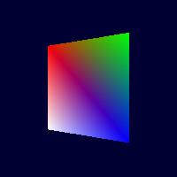
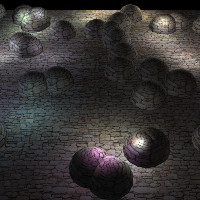
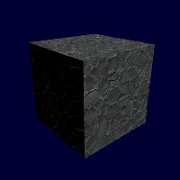

# dawn-gfx
A low level multi-threaded graphics abstraction layer. Supports OpenGL 3+, WebGL and Vulkan (experimental).

1. [Dependencies](#introduction)
    1. [OpenGL renderer](#opengl-renderer)
    2. [Vulkan renderer](#vulkan-renderer)
2. [Usage](#usage)
    1. [Shaders](#shaders)
        1. [Uniforms](#uniforms)
        2. [Resource bindings](#resource-bindings)
    2. [Hello world](#hello-world)
    
  
    
### Dependencies

Most dependencies are pinned using CMake's `FetchContent` feature. However, the OpenGL and Vulkan renderers
both have their own dependencies:

#### OpenGL renderer

Windows and macOS have no dependencies, as OpenGL functions are loaded from the driver directly.
Linux platforms require Xorg development libraries.

Ubuntu:

    $ sudo apt-get install xorg-dev
    
Arch Linux:

    $ sudo pacman -S xorg-server

    
#### Vulkan renderer

The latest Vulkan SDK by LunarG needs to be installed from [here](https://vulkan.lunarg.com/sdk/home). Linux platforms also require Xorg development libraries.

Arch Linux provides Vulkan development libraries in the following package:

    $ sudo pacman -S vulkan-devel

### Usage

#### Shaders

dawn-gfx uses Vulkan SPIR-V shaders for rendering. Under the hood, different rendering backends transpile the SPIR-V
bytecode into the compatible high-level shader language (such as GLSL or ESSL). The library comes with a helper function
called `compileGLSL` in `<dawn-gfx/Shader.h>` that compiles Vulkan GLSL into SPIR-V, but a different compiler such as
[dxc](https://github.com/Microsoft/DirectXShaderCompiler/wiki/SPIR%E2%80%90V-CodeGen) can be used instead.

##### Uniforms

When writing shaders, uniforms must be contained within [uniform blocks](https://www.khronos.org/opengl/wiki/Interface_Block_(GLSL)#Uniform_blocks)
to match the Vulkan GLSL spec, preferably grouped by update frequency. However, dawn-gfx manages uniform buffers
automatically, and individual uniforms can be set individually before calling `submit(...)`. For example, if a shader
has the following uniform block:

```glsl
layout(binding = 0) uniform PerFrame {
    vec3 light_direction;
};

layout(binding = 1) uniform PerSubmit {
    mat4 mvp_matrix;
    mat4 model_matrix;
};
```

The API to set them is:
```cpp
r.setUniform("light_direction", Vec3{1.0f, 0.0f, 0.0f});
r.setUniform("mvp_matrix", projection * view * model);
r.setUniform("model_matrix", model);
...
r.submit(...);
```

##### Resource bindings

Resources such as uniform buffer blocks and combined image samplers must have a binding location set using
`location(binding = n)`, and no two resources can share the same binding location. Binding locations occupied by uniform
blocks are managed automatically, but texture resources need to be bound manually using code such as:

```cpp
r.setTexture(texture_handle, /* binding location */ 1);
...
r.submit(...);
```

#### Hello world

Here is an illustration of how to draw a single triangle. Shaders has been omitted for the sake of
brevity, but can be found here:
[basic_colour.vert](https://github.com/dgavedissian/dawn-gfx/blob/develop/examples/media/shaders/basic_colour.vert),
[basic_colour.frag](https://github.com/dgavedissian/dawn-gfx/blob/develop/examples/media/shaders/basic_colour.frag).
```cpp
#include <dawn-gfx/Renderer.h>
#include <dawn-gfx/Shader.h>

using namespace dw::gfx;

Renderer r;
VertexBufferHandle vertex_buffer;
ProgramHandle program_handle;

void setup() {
    r.init(RendererType::Vulkan, 1024, 768, "Hello triangle", {}, true);

    // Load shaders. Omitted for brevity.
    auto vs = compileGLSL(...);
    auto fs = compileGLSL(...);
    program_handle = r.createProgram();
    r.attachShader(program_handle, vs);
    r.attachShader(program_handle, fs);
    r.linkProgram(program_handle);

    // Set up vertex buffer.
    struct Vertex { float x; float y; u32 colour; };
    Vertex vertices[] = {
        // Little-endian, so colours are 0xAABBGGRR.
        {0.0f, 0.5f, 0xff0000ff},   // Vertex 1: Red
        {-0.5f, -0.5f, 0xff00ff00}, // Vertex 2: Green
        {0.5f, -0.5f, 0xffff0000}   // Vertex 3: Blue
    };
    VertexDecl decl;
    decl.begin()
        .add(VertexDecl::Attribute::Position, 2, VertexDecl::AttributeType::Float)
        .add(VertexDecl::Attribute::Colour, 4, VertexDecl::AttributeType::Uint8, true)
        .end();
    vertex_buffer = r.createVertexBuffer(Memory(vertices, sizeof(vertices)), decl);
}

void render() {
    r.setRenderQueueClear({0.0f, 0.0f, 0.2f});
    r.setVertexBuffer(vertex_buffer);
    r.submit(program_handle, /* vertex count */ 3);
}
```
